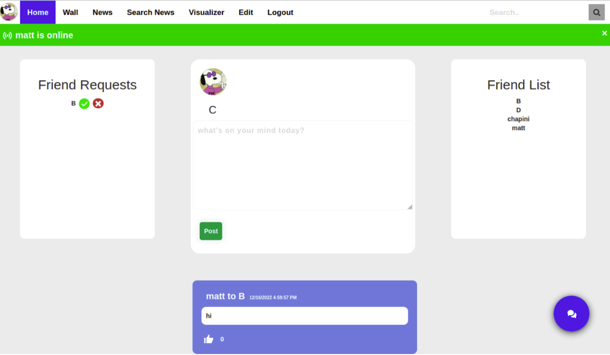
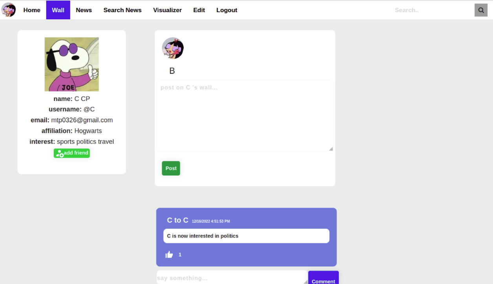
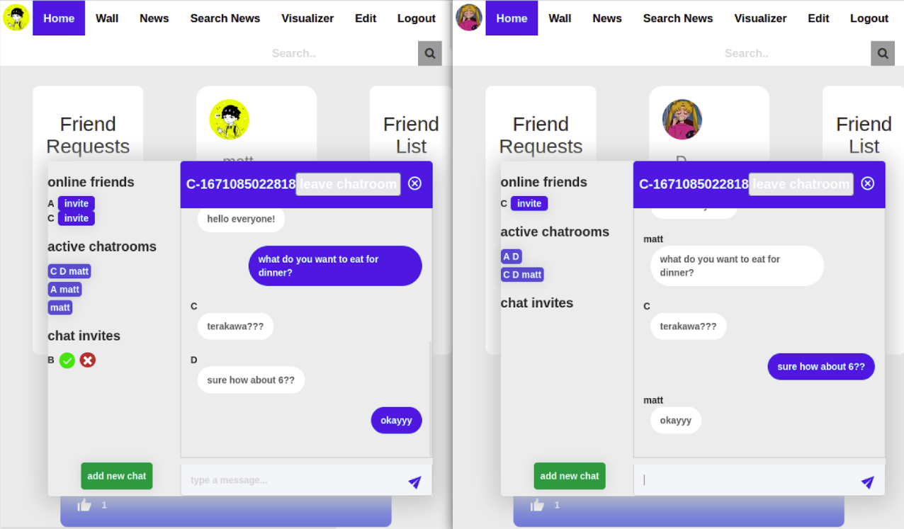

# Welcome to PetBook!!!🐶🐱

- Cindy Wei (Frontend), Jiwoong (Matt) Park (Backend, Markdown)
- 2022.11.09 ~ 2022.12.19

## Overview

PetBook is a social media platform where pet owners can post their pets, share life updates, and connect with the pet community.

Our application includes the following features – hashed user registration, account status edits, social feeds, writing posts or comments, uploading pet pictures, group chat, friends’ live status, and search/add/delete friends.

For the project, we have utilized tools introduced in our course - JavaScript, Java with frameworks/tools like AWS (DynamoDB, S3), NodeJS, Spark, Livy, AJAX, Socket.io and many others.

## Webpage Flowchart

## User Accounts

The user registers through sign up where the user has to fill in their basic personal identifying information. In addition to inputting the personal information, the users also have to choose three interests from categories that would show up in the dropdown menu. Security measures are inputted to protect the password, which will be discussed later.

The edit page allows users to edit their account information. They can change their first name, last name, password, email, affiliation, interest, and profile picture. When you visit the edit page, every field is initially populated with the current user’s profile information except for the password. In order to edit their account, the users must enter the correct password to submit. Once the information is edited, each altered field is updated in the DynamoDB table, replacing the old data. When an interest is updated, a post, created through an AJAX call, announcing the user’s interest is automatically created and added to the user’s wall.

## Homepage and Walls

  
  

The home page displays all of the posts created by user, all walls the user received, and get friend’s posts and walls friends received using recursion in routes through each friend of the user. The posts are sorted chronologically. All posts created from the homepage will be displayed with a title, the post creator, the date, the post content, and the comments. All homepage posts are stored in the DynamoDB table ‘posts’.

The wall gets all posts created by wall’s user, all walls the wall’s user received, and all walls the wall’s user sent to friends through recursing wall user’s friends. All posts created from the wall will have the title “[Sender] to [Receiver]” indicating the sender and receiver. The post contains the date, post contents, and comments. Like the homepage, users can write on their wall, and the post will pop-up at the top of a chronologically ordered list. All wall posts are stored in the DynamoDB table ‘walls’.

Each homepage and wall post display the number of likes, which is calculated from the string set of usernames collected from those who liked the post. This also means that a user who has already liked a post cannot like the post again. From the homepage and a wall, users can make comments displaying their username and its contents. The most recent comments are automatically displayed at the bottom of the list for a particular post. The comments are updated to the DynamoDB table ‘users’ or ‘walls’ respectively, under the “comments” attribute of the post.

## Friends

Users can search for other users with the search bar located in the top right corner of the home page. The search bar suggests different usernames depending on what is initially inputted through an AJAX call that gets all of the usernames and returns the suggested usernames. If the entered username does not exist, then the search returns to the previous page. If the entered username exists, the user is sent to that user’s wall.

## Dynamic content

On the left side of the homepage screen, it shows a list of friend requests. We check for new friend requests every 5 seconds, so the friend request would appear immediately after it is sent. On the frontend, we keep a list of friend requests, online users, posts, and friends; so, when an AJAX call receives new information every 5 seconds, we only display the newly added elements to avoid flickering. Whenever a user adds a new friend, the friend list is updated. If a user’s friend is online, a notification saying, “this friend is now online” pops up. When a friend request is accepted, both users receive a notification.

## Chat

Users can access chat using the ‘Chat’ pop-up button on the lower right corner of the homepage. The layout includes a bar on the left displaying all online friends, user’s existing chats, a button to start a new chat, and chat invites waiting to be accepted or rejected. When a user logs in, their username is updated in the ‘online’ table string set, and removed from the database when they log out. We constantly get this information – as well as the existing chatrooms, and chat invites – allowing us to show the most up-to-date list of online users at all times. Users can open a chat room from the list of their active chat rooms.

To minimize traffic usage when connected between users, we used Socket.io. We also used DynamoDB with sets of users that were online, so if a user goes to the chat feature, the backend would automatically query for the online users that are friends with the current user.

#### Chat Invites & Group Chat

Users can send invites for the chat rooms they are in. To do that, the user first accesses the chat room, and invites friends from the ‘online friends’ list by clicking on the ‘invite’ button next to their username. The recipient of the invite can see it on their chat pop-up window, which shows them two options: accept or reject. If they accept it, they are now added to the chatroom and can view every message that has been sent in the chat room.
To create a new group chat, users press the ‘add new chat’ button. This creates a chatroom instance with just that user and is added to the chatroom database and the chatroom id is updated to the user’s database. Once it is created, users can add online friends by clicking the invite button next to the username on the online friends list on the left side of the chat window. Newly added users will be able to see all the messages in the group chat, including ones from before they joined. Users can leave a chatroom by clicking on a button next to the group chat id. All chat rooms continue to work as long as at least one member remains in the group.

#### Message Ordering

The messages in the chatrooms are stored as separate instances in the ‘chatrooms’ table in which has a list where the entities includes not only the message content, but the sender’s username, and time created. We use the timestamp to chronologically order the messages and maintain consistency for all users in the chat. The chatrooms also have a set of user IDs to check who is in the group chat. Each chat room is also a separate instance in the ‘chatrooms’ table, separate from any of its users. Hence the contents in the chat room remain as it is regardless of users joining or leaving the chat room. Each chat room’s key is uniquely made with a combination of the creator’s username and the timestamp of created time.

## Security and Scalability

The passwords, encrypted using SHA-256 in the Stanford Javascript Crypto Library (SJCL), are hashed and sent to the database, which is stored in the DynamoDB table ‘users’. Our group used DynamoDB to store data of each user, their posts and comments, and news articles as a scalable database.
